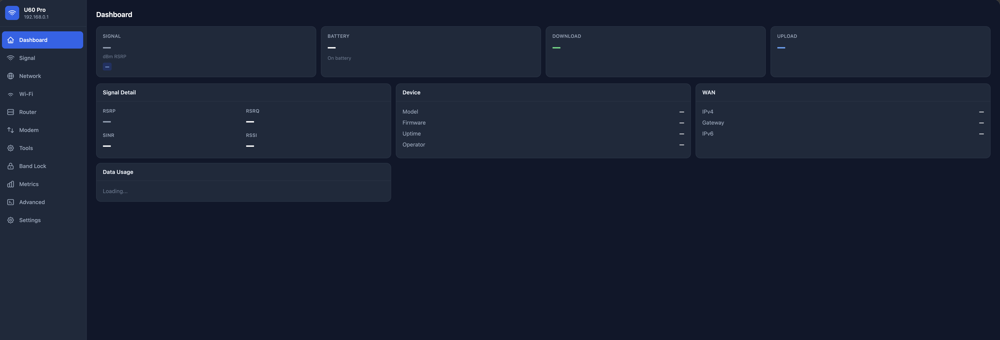

<div align="center">

# Open U60 Pro

**An open toolkit for the ZTE U60 Pro (MU5250) 5G router.**

A Rust agent running on the device exposes 154 REST endpoints for full router control.
Companion apps (web dashboard, iOS, Android) connect over WiFi — no cloud, no accounts, no telemetry.

<p>

</p>

</div>

---

## What You Can Do

### Signal & Connectivity

- **Monitor signal strength** — RSRP, RSRQ, SINR, RSSI per carrier component (LTE PCC + SCCs, NR PCC + SCCs), polled every 3 seconds
- **Band lock** — Restrict LTE and NR to specific bands (e.g. lock to n78 only, or B3+n78)
- **Cell lock** — Lock to a specific cell by PCI + ARFCN/EARFCN
- **Network mode** — Force 5G+4G, 5G SA, 5G NSA, 4G only, or 3G
- **Neighbor scan** — Discover nearby LTE and NR cells
- **Signal quality detection** — Automated signal quality assessment with progress tracking
- **Smart Tower Connect (STC)** — Whitelist-based cell preference management
- **Airplane mode** — Toggle LPM/Online modem state
- **Operator scan & manual registration** — Scan for available networks and manually register

### Dashboard & Monitoring

- **Real-time dashboard** — Signal, battery, speed, CPU, memory, data usage in a single batch request
- **Speed monitoring** — Real-time WAN throughput (rx/tx bps) with peak tracking via rolling ring buffer
- **Data usage** — Daily, monthly, and lifetime usage with rx/tx breakdown
- **Thermal monitoring** — 10 thermal zones: CPU cores, modem DSP, PA, SDR, battery, USB, ETH PHY, PMIC, board
- **Battery detail** — Capacity, voltage (instant + OCV), current, power, temperature, charge type, health, cycle count, time to full/empty
- **Process list** — Top 50 processes by CPU with bloatware identification
- **Signal logger** — Record signal metrics to CSV at configurable intervals (up to 24 hours)
- **Connection logger** — Record cell handovers, band changes, NR connect/disconnect events to CSV
- **Alerts** — Automatic warnings for battery temperature, low charge, CPU thermal throttling

### WiFi

- **Full WiFi configuration** — SSID, password, channel, bandwidth, TX power, encryption, hidden SSID for both 2.4 GHz and 5 GHz radios
- **WiFi 7 (802.11be) control** — Toggle WiFi 6/7 features
- **Guest network** — Separate SSID with configurable active time, isolation, and per-radio enable
- **Connected clients** — List all connected devices with MAC, IP, and hostname

### Router Configuration

- **DNS settings** — Set custom DNS servers (IPv4 + IPv6) with quick presets (Cloudflare, Google, Quad9)
- **LAN/DHCP** — Configure router IP, subnet mask, DHCP range, and lease time
- **Firewall** — On/off switch, security level, NAT forwarding, DMZ host, UPnP
- **Port forwarding** — Add/remove port forwarding rules with protocol, port range, and target IP
- **MAC/IP/port filtering** — Device-level access control rules
- **QoS** — Traffic shaping toggle
- **Domain filtering** — Block or allow specific domains
- **VPN ALG** — Configure VPN passthrough protocols (IPSec, PPTP, L2TP)
- **DNS-over-HTTPS** — Built-in DoH proxy with cache management and dnsmasq integration

### Modem & SIM

- **APN management** — Auto or manual mode, add/modify/delete/activate APN profiles, quick carrier presets
- **SIM info** — ICCID, IMSI, carrier (MCC/MNC), IMEI (read-only, hardware fused)
- **SIM PIN** — Verify, change, and enable/disable PIN lock
- **Network unlock** — Submit NCK code with remaining attempt counter
- **Data call control** — Enable/disable IPv4 and IPv6 data sessions
- **TTL clamping** — Set or clear iptables TTL mangling rules (persisted across reboots)

### SMS

- **SMS inbox** — List, read, delete messages with unread tracking
- **Send SMS** — Compose and send with Unicode support
- **Auto-forwarding** — Rule-based SMS forwarding to Telegram, Discord, Slack, ntfy, webhook, or another SMS number
  - Filter by sender (with wildcard patterns), content keywords, or both
  - Configurable poll interval, auto-mark-read, auto-delete
  - Forwarding log with retry support

### Telephony

- **Voice calls** — Dial, hangup, answer, with live call status (active, held, dialing, incoming, waiting)
- **DTMF tones** — Send tones during active calls
- **Mute control** — Toggle microphone during calls
- **USSD codes** — Send USSD requests (e.g. `*100#` for balance), respond to multi-step menus, cancel sessions
- **SIM Toolkit (STK)** — Browse and select SIM Toolkit menus

### Tools & Automation

- **AT console** — Send read-only AT commands to the modem (allowlisted for safety — no destructive commands)
- **Speed test** — Built-in Speedtest.net client with latency, download, upload measurement and live progress
- **LAN throughput test** — Measure WiFi/LAN speed with download and upload streams up to 2 GB
- **USB mode** — Switch between RNDIS, ECM, NCM, and debug modes
- **Power bank** — Control USB power bank output
- **Scheduler** — Create one-time or recurring jobs that execute any safe API endpoint at a specified time, with optional restore action
- **Charge control** — Manually stop/resume charging, set charge limit with hysteresis
- **Bloatware removal** — Identify and kill unnecessary ZTE daemons (TR-069, MQTT, Samba, NFC, diagnostics) freeing ~224 MB RAM
- **Reboot & factory reset** — With confirmation header protection against accidental triggers

---

## Architecture

```
                    ┌─────────────────────┐
                    │   ZTE U60 Pro        │
                    │   (OpenWrt/ARM64)    │
                    │                      │
                    │  ┌────────────────┐  │
                    │  │  zte-agent     │  │     ┌──────────────────┐
  Phone/Laptop ───────│  :9090 (Rust)  │────────│  ubus / sysfs /  │
  (WiFi)              │  │  2.4 MB binary│  │     │  AT / UCI       │
                    │  └────────────────┘  │     └──────────────────┘
                    │         │            │             │
                    │  ┌──────┴───────┐    │      ┌──────┴──────┐
                    │  │ uhttpd :8080 │    │      │  Qualcomm   │
                    │  │ (dashboard)  │    │      │  SDX75      │
                    │  └──────────────┘    │      └─────────────┘
                    └─────────────────────┘
```

The agent is a single ~2.4 MB Rust binary that runs directly on the router. It translates ubus calls, AT commands, sysfs reads, and UCI operations into a typed REST API. No external dependencies, no runtime, no telemetry.

| | zte-agent | Stock ZTE stack |
|---|---|---|
| **Processes** | 1 | 44 |
| **Memory (RSS)** | ~2.3 MB | 225 MB |
| **Binary size** | ~2.4 MB | ~50+ MB combined |
| **Threads** | ~15 | ~130+ |
| **Telemetry** | None | Phones home to ZTE |

---

## Quick Start

### Prerequisites

```bash
rustup target add aarch64-unknown-linux-musl
brew install filosottile/musl-cross/musl-cross   # macOS
brew install android-platform-tools               # for ADB
```

### First-Time Setup

**Browser** — Visit [open-u60-pro.vercel.app](https://open-u60-pro.vercel.app), connect USB, click Deploy.

**Command line** — `./setup.sh <router-password> <agent-password>`

### Deploy Updates

```bash
./deploy.sh                          # build + deploy agent
./deploy-dashboard.sh /data/www      # build + deploy web dashboard
```

### Connect

1. Connect to the router's WiFi
2. Open `http://192.168.0.1:8080` for the web dashboard
3. Or use the iOS/Android companion apps pointing to `http://192.168.0.1:9090`

---

## Project Structure

```
├── zte-agent/              On-device REST API (Rust, Axum on tiny_http)
│   └── src/                154 endpoints across 25 modules
├── dashboard/              Web dashboard (React + Vite + Tailwind)
│   └── src/pages/          11 pages: Dashboard, Signal, Network, WiFi,
│                           Router, Modem, SMS, Band Lock, Metrics,
│                           Advanced, Tools, Settings
├── mobile/ios/             SwiftUI companion app (109 Swift files)
├── mobile/android/         Jetpack Compose companion app (90 Kotlin files)
├── web/                    Landing page & setup wizard (Next.js)
├── deploy.sh               Agent build + deploy script
├── deploy-dashboard.sh     Dashboard build + deploy script
└── setup.sh                First-time device setup (ADB)
```

---

## Security Model

- **Authentication** — Salted iterated SHA-256 (10,000 rounds) with 32-byte random salt. Bearer tokens with 1-hour expiry, max 10 concurrent sessions.
- **Rate limiting** — 5 failed login attempts per IP, then 30-second lockout.
- **CORS** — Restricted to RFC 1918 private IPs only (10.x, 172.16-31.x, 192.168.x).
- **Bind address** — Defaults to `192.168.0.1:9090` (LAN only, not WAN-accessible).
- **AT commands** — Allowlisted to read-only operations. Destructive commands (`AT+CFUN`, `AT^RESET`, etc.) are blocked.
- **Scheduler** — Cannot schedule destructive endpoints (reboot, factory reset, AT commands, airplane mode).
- **Destructive actions** — Reboot and factory reset require `X-Confirm: true` header.
- **Input validation** — All ubus passthrough inputs validated (max depth 8, string length 4096, 64 keys max).
- **Credential masking** — WiFi passwords and SMS forwarder bot tokens masked in API responses.
- **No telemetry** — The agent never phones home. Zero outbound connections except user-configured SMS forwarding.

---

## Signal Reference

| Metric | Excellent | Good | Fair | Poor |
|---|---|---|---|---|
| **RSRP** (dBm) | >= -80 | >= -100 | >= -110 | < -110 |
| **SINR** (dB) | >= 20 | >= 10 | >= 0 | < 0 |
| **RSRQ** (dB) | >= -10 | >= -15 | >= -20 | < -20 |

---

## Device Specs

| | |
|---|---|
| **Model** | ZTE U60 Pro (MU5250) |
| **Chipset** | Qualcomm Snapdragon X75 (SDX75) |
| **CPU** | 4x Cortex-A55 @ 2.2 GHz |
| **RAM** | 1.6 GB |
| **Storage** | 8 GB eMMC |
| **Modem** | 5G-A Sub-6 + mmWave, Cat 22 LTE |
| **WiFi** | WiFi 7 (802.11be), 2x2 MIMO, EHT160 |
| **Battery** | 10,000 mAh, USB-PD 15W |
| **Display** | 3.5" IPS LCD, 320x480 |
| **OS** | ZWRT (OpenWrt 23.05.4), Linux 5.15 |
| **SIM** | Single nano-SIM |
| **Clients** | Up to 64 (32 per radio) |

---

## License

[MIT](LICENSE) — Not affiliated with ZTE Corporation. Use at your own risk. Reverse engineering performed for interoperability purposes only.
