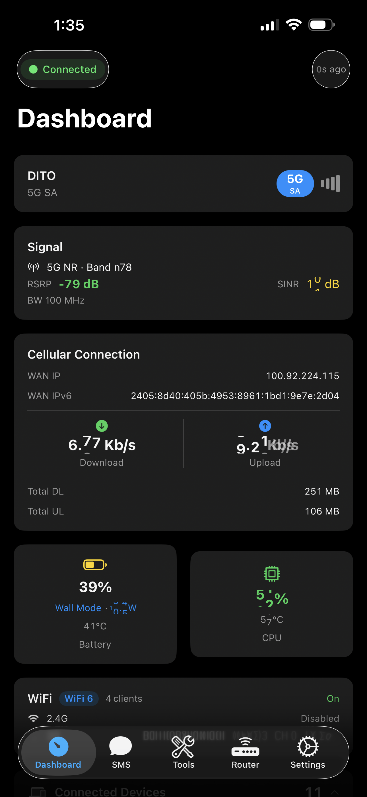
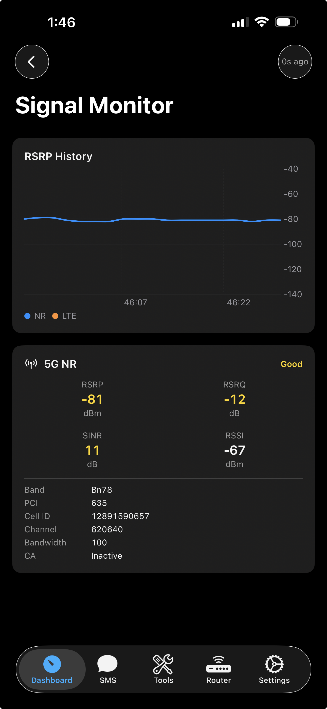
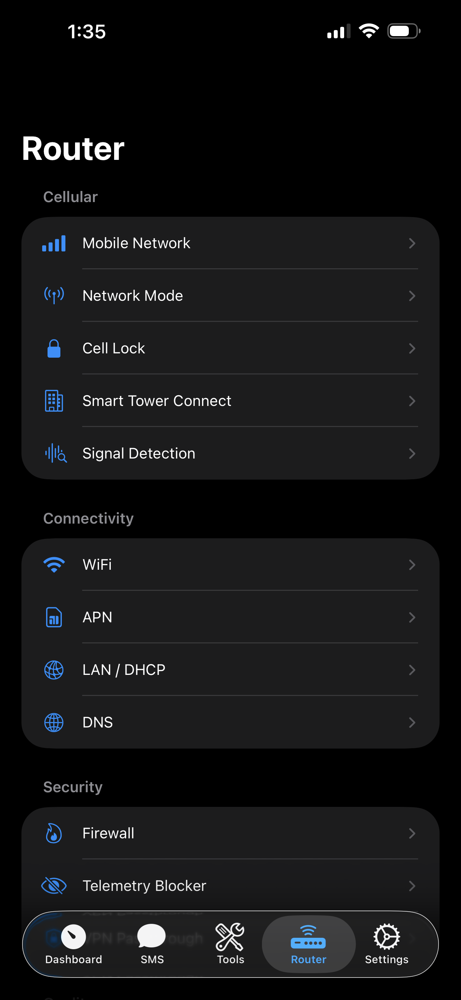

<div align="center">

<p>
&nbsp;&nbsp;&nbsp;&nbsp;
</p>

# ZTE U60 Pro Toolkit

**Unlock the full potential of your ZTE U60 Pro (MU5250) 5G mobile router.**

On-device REST agent + native mobile companion apps for signal monitoring, band locking,
config backup/decryption, network customization, and more.

[](https://www.rust-lang.org/)
[-orange.svg)]()
[]()
[-green.svg)]()
[](https://open-u60-pro.vercel.app)

</div>

---

## Device

| | |
|---|---|
| **Model** | ZTE U60 Pro (MU5250) |
| **Hardware** | `MU5250_HW1.0` |
| **Firmware** | `CN_ZTE_MU5250V1.0.0B27` (Oct 31, 2025) |
| **Chipset** | Qualcomm Snapdragon X75 (SDX75 / SDXPINN) |
| **CPU** | 4x Cortex-A55 (ARMv8.2-A) @ 2.2 GHz |
| **RAM** | 1.6 GB |
| **Storage** | 8 GB eMMC (Longsys JS08AC), 69 partitions, A/B slots |
| **Modem** | 5G-A Sub-6 + mmWave, Cat 22 LTE |
| **NR Bands** | n1/2/3/5/7/8/18/20/26/28/29/38/40/41/48/66/71/75/77/78/79 |
| **LTE Bands** | 1/2/3/4/5/7/8/18/19/20/26/28/29/32/34/38/39/40/41/42/43/48/66/71 |
| **WiFi** | WiFi 7 (802.11be), 2x2 MIMO, EHT160 |
| **WiFi Chipset** | Qualcomm WCN7851 (`qcacld32`) |
| **WiFi Radios** | 2.4 GHz (ch 1-13, EHT40, 19 dBm) · 5 GHz (ch 36-165, EHT160, 18 dBm) |
| **Battery** | 10,000 mAh Li-ion, 4.5V max, PM7550B fuel gauge |
| **Charging** | USB-PD, 15W (5V/3A), fast charge |
| **USB** | USB-C (PD sink, OTG/powerbank) |
| **Display** | 3.5" IPS LCD (Sitronix ST77926), 320x480, RGB565, DRM/KMS |
| **UI Toolkit** | LVGL with FreeType + LodePNG, assets at `/usr/ui/` |
| **Backlight** | AWINIC AW9523B (I2C `1-005b`), sysfs `/sys/class/leds/led:lcd/brightness` (0-255) |
| **Touch** | Sitronix (I2C `1-0055`) -> `/dev/input/event3` |
| **OS** | ZWRT (OpenWrt 23.05.4 r24012-d8dd03c46f) |
| **Kernel** | Linux 5.15.170-perf, SMP PREEMPT, aarch64 |
| **PMICs** | PMX75 + PM7550BA + PMG1110 |
| **SIM** | Single nano-SIM (no eSIM) |
| **NFC** | Quick device pairing |
| **Bluetooth** | Qualcomm WCN7850 (BT 5.3+), UART transport — disabled (services stopped, module unloaded) |
| **Clients** | Up to 64 (32 per radio) |

## What's Included

### On-Device Agent (`zte-agent`)

A lightweight Rust HTTP server that runs directly on the router (port 9090, LAN-only). It proxies ubus calls, AT commands, and sysfs reads into a typed REST API that mobile apps consume over WiFi.

```bash
# Cross-compile for the device
cargo build --release --target aarch64-unknown-linux-musl -p zte-agent
```

**143 endpoints across 16 categories:**

| Category | # | Capabilities |
|---|---|---|
| Device | 14 | System info, battery, CPU, memory, thermal, charger, charge control, reboot, factory reset, power save |
| Network | 9 | Signal strength (RSRP/SINR/RSRQ), speed, traffic stats, WAN/LAN status, rmnet, connected clients |
| Modem | 12 | Airplane mode, mobile data toggle, network mode (2G-5G), operator scan, manual registration |
| SMS | 5 | List, send, delete, mark read, storage capacity |
| SIM | 7 | SIM info, IMEI, PIN management, PUK unlock |
| Cell/Band | 19 | NR/LTE band locking, cell locking, neighbor scan, STC, signal quality detection |
| Router | 29 | DNS, LAN/DHCP, firewall, NAT, DMZ, UPnP, port forwarding, QoS, domain filter, APN profiles, VPN/ALG |
| WiFi | 4 | Status, SSID/password/channel/TX power, guest WiFi |
| USB | 3 | USB mode switching, powerbank control |
| Telephony | 11 | Voice calls (dial/hangup/answer/DTMF/mute), USSD codes, SIM Toolkit menus |
| Speed Test | 4 | Server list, run test, progress tracking |
| DoH Proxy | 6 | DNS-over-HTTPS proxy, cache management |
| LAN Test | 3 | WiFi ping, download/upload throughput measurement |
| SMS Forwarding | 9 | Auto-forward rules, CRUD, test, log management |
| System | 2 | Process list, kill bloatware |
| Scheduler | 5 | Scheduled/recurring jobs for any API action |

### Mobile Companion Apps

Native apps that connect directly over WiFi -- no computer needed.

| | iOS | Android |
|---|---|---|
| **Framework** | SwiftUI | Jetpack Compose |
| **Min Version** | iOS 16.0 | Android 8.0 (API 26) |
| **Dependencies** | None (Apple frameworks only) | OkHttp, Hilt, Vico, kotlinx.serialization |
| **Features** | BandLock, Call, Clients, Config, Dashboard, DeviceInfo, Login, RouterSettings, Scheduler, Signal, SIM/STK/USSD, SMS, Tools, USBMode | BandLock, Clients, Config, Dashboard, DeviceInfo, Login, RouterSettings, Scheduler, Signal, SIM/STK, SMS, Tools, USBMode |
| **Tabs** | Dashboard, SMS, Tools, Router, Settings | Dashboard, SMS, Tools, Router, Settings |
| **Path** | `mobile/ios/OpenU60/` (109 Swift files) | `mobile/android/OpenU60/` (90 Kotlin files) |

## Why Use This Instead of the Official ZTE App?

The stock ZTE U60 Pro runs **44 proprietary daemons** consuming **225 MB of RAM** just for device management. Many of these are unnecessary (TR-069 remote management, MQTT telemetry, Samba, NFC, diagnostics) and phone home to ZTE servers.

`zte-agent` replaces the need for the official ZTE management app with a single ~2.3 MB binary:

| | zte-agent | ZTE Official Stack |
|---|---|---|
| **Processes** | 1 | 44 |
| **Memory (RSS)** | ~0.8 MB | 225 MB |
| **Binary size** | ~2.3 MB | ~50+ MB combined |
| **Threads** | ~10 | ~130+ |
| **Telemetry** | None | Phones home to `iot.zte.com.cn` etc. |
| **App** | Open-source native iOS/Android | Closed-source, Chinese-only |

The official ZTE stack's top memory consumers:

| Process | RAM | Purpose |
|---------|-----|---------|
| `zte_topsw_devui` | 22.8 MB | LCD UI daemon |
| `zte_topsw_get_brand` | 14.2 MB | Carrier branding |
| `zte_topsw_data` | 10.9 MB | Mobile data management |
| `zte_topsw_tr069` + subs | 23.2 MB | ISP remote management |
| `zte_topsw_diag` | 7.1 MB | Diagnostics/logging |

zte-agent provides equivalent API access to the same underlying ubus/AT services using **0.35% of the memory** -- freeing ~224 MB of RAM for actual routing and WiFi workloads.

## Device Impact

> **Warning** -- The agent exposes device control endpoints that modify firmware settings.
> Destructive actions (factory reset, reboot) require confirmation in the mobile app.

### Filesystem Layout

```
/data/                              (writable /data partition)
├── zte-agent                       <- on-device REST agent
└── local/tmp/
    ├── start_zte_agent.sh          <- agent boot script
    ├── dropbear                    <- SSH binary (if installed)
    └── start_dropbear.sh          <- SSH boot script (if installed)

/etc/                               (read-only rootfs)
├── rc.local                        <- boot hooks appended here
└── dropbear/
    ├── authorized_keys             <- SSH public key (if installed)
    └── dropbear_rsa_host_key       <- generated host key (if installed)
```

## Quick Start

### Prerequisites

```bash
# 1. Install Rust -- see https://rustup.rs
curl --proto '=https' --tlsv1.2 -sSf https://sh.rustup.rs | sh

# 2. Add musl cross-compilation target
rustup target add aarch64-unknown-linux-musl

# 3. Install musl cross-linker
# macOS:
brew install filosottile/musl-cross/musl-cross
# Ubuntu/Debian:
sudo apt install musl-tools gcc-aarch64-linux-gnu

# 4. Install ADB
# macOS:
brew install android-platform-tools
# Ubuntu/Debian:
sudo apt install android-tools-adb

# 5. Build the agent
cargo build --release --target aarch64-unknown-linux-musl -p zte-agent
```

### First-Time Setup

For a factory-fresh device that has never had zte-agent installed:

**Option A -- Browser (no tools needed)**

Visit [open-u60-pro.vercel.app](https://open-u60-pro.vercel.app), enter your router password and desired agent password, connect USB, and click Deploy. Requires Chrome or Edge.

**Option B -- Command line**

```bash
./setup.sh <router-password> <agent-password>
```

Enables ADB, builds and pushes the agent, creates boot scripts, and optionally sets up SSH for wireless deploys.

### Deploy Agent (subsequent updates)

```bash
./deploy.sh yourpassword
```

This builds, deploys the binary to the device via SSH (port 2222), updates the boot password, and restarts the agent.

### Connect Mobile App

1. Connect your phone to the router's WiFi
2. Open OpenU60 app
3. Set agent URL: `http://192.168.0.1:9090`
4. Enter the agent password you set above

## Project Structure

```
u60-Pro-rs/
├── zte-agent/                 On-device REST API server
│   └── src/
│       ├── main.rs            Entry point (Axum HTTP server)
│       └── routes/            REST endpoint handlers
│
└── mobile/                    Native companion apps
    ├── README.md              Mobile apps documentation
    ├── ios/OpenU60/           SwiftUI app
    │   ├── Core/              Networking, crypto, models
    │   ├── Features/
    │   │   ├── BandLock/      Band locking
    │   │   ├── Call/          Voice calls
    │   │   ├── Clients/       Connected devices
    │   │   ├── Config/        Config backup/restore
    │   │   ├── Dashboard/     Signal cards, WiFi card, status
    │   │   ├── DeviceInfo/    Hardware + firmware info
    │   │   ├── Login/         Auth + keychain
    │   │   ├── RouterSettings/
    │   │   │   ├── APN/       APN profile management
    │   │   │   ├── CellLock/  Cell locking
    │   │   │   ├── Device/    Reboot, USB, battery, charge policy
    │   │   │   ├── DNS/       DNS settings
    │   │   │   ├── Firewall/  Firewall rules
    │   │   │   ├── LAN/       DHCP settings
    │   │   │   ├── MobileNetwork/  Network mode, SA/NSA
    │   │   │   ├── NetworkMode/    Network selection
    │   │   │   ├── QoS/       Traffic shaping
    │   │   │   ├── Schedule/  Scheduled reboot/wifi
    │   │   │   ├── SignalDetect/   Signal quality detection
    │   │   │   ├── SIM/       SIM card PIN/PUK management
    │   │   │   │   └── STK/   SIM Toolkit & USSD
    │   │   │   ├── STC/       Smart Tower Connect
    │   │   │   ├── Telemetry/ Telemetry blocking
    │   │   │   ├── VPN/       VPN settings
    │   │   │   └── WiFi/      WiFi configuration
    │   │   ├── Scheduler/     Scheduled/recurring jobs
    │   │   ├── Settings/      App settings
    │   │   ├── Signal/        Signal monitor
    │   │   ├── SMS/           SMS compose/read/conversations
    │   │   ├── Tools/         Band lock, clients, config, etc.
    │   │   └── USBMode/       USB mode detection/switching
    │   └── Navigation/        5-tab bar (Dashboard, SMS, Tools, Router, Settings)
    └── android/OpenU60/       Jetpack Compose app
        ├── core/              Network, crypto, models, DI
        ├── feature/           bandlock, clients, config, dashboard,
        │                      deviceinfo, login, router, scheduler,
        │                      settings, signal, sms, tools, usb
        └── navigation/        NavHost + bottom bar

├── web/                       Landing page & web dashboard (open-u60-pro.vercel.app)
│   ├── src/
│   │   ├── app/               Next.js app router (page, layout, globals)
│   │   ├── components/        Landing sections, UI primitives
│   │   └── data/              Feature data, API endpoints, device specs
│   └── public/                Static assets (images, icons)
```

## Signal Thresholds

| Metric | Excellent | Good | Fair | Poor |
|---|---|---|---|---|
| **RSRP** (dBm) | >= -80 | >= -100 | >= -110 | < -110 |
| **SINR** (dB) | >= 20 | >= 10 | >= 0 | < 0 |
| **RSRQ** (dB) | >= -10 | >= -15 | >= -20 | < -20 |

## License & Disclaimers

This project is licensed under the [MIT License](LICENSE).

**Disclaimer:** This software is provided "as is", without warranty of any kind. Use it at your own risk. The authors are not responsible for any damage to your device, voided warranties, or other consequences arising from the use of this software.

- **Not affiliated with ZTE Corporation.** This is an independent community project.
- Intended for use on devices you personally own.
- Reverse engineering was performed solely for interoperability and educational purposes.
- Encryption keys and protocol details are sourced from publicly available community research.
- No proprietary source code from ZTE is included in this repository.
