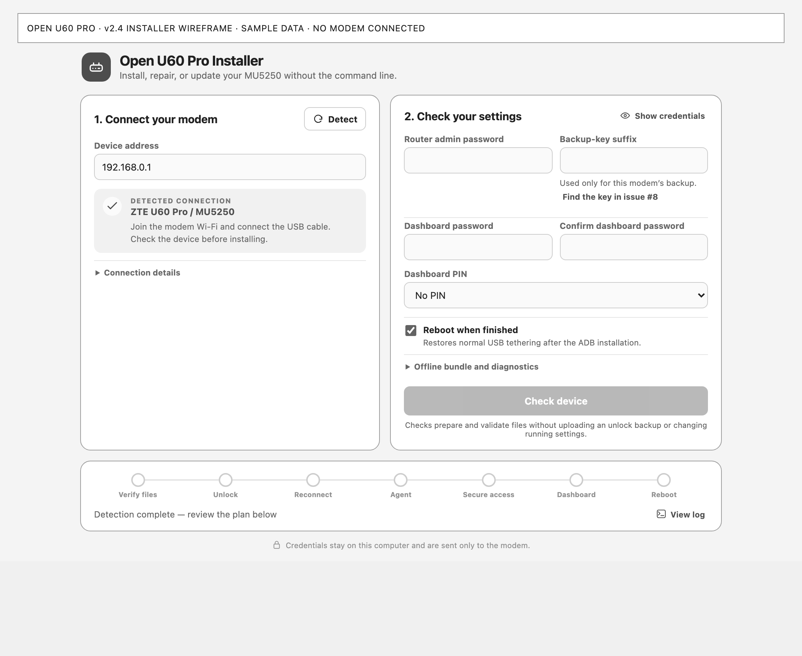
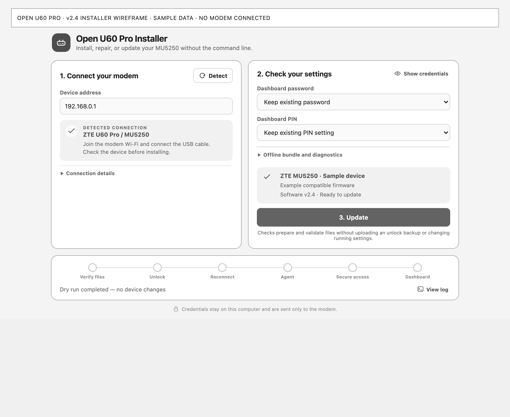
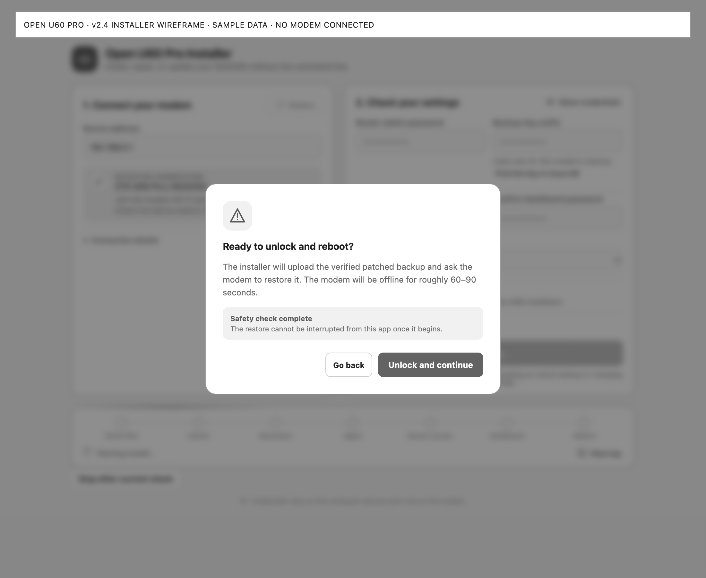
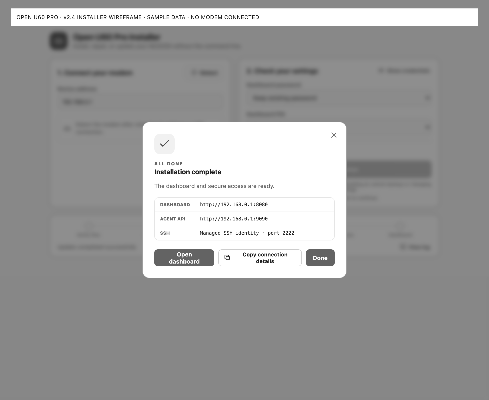
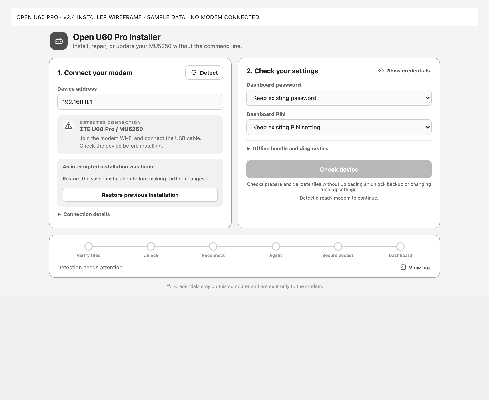

# v2.4 installer wireframes

These publishable wireframes show the actual installer interface with a grayscale
presentation and **sample data**. No modem was connected during capture. They
illustrate the workflow, not the outcome of a physical deployment.

## Connect and configure

## Review a successful check

Updates preserve existing passwords and PIN settings by default.

## Confirm a prepared unlock

The confirmation appears after native backup preparation and validation.

## Open the dashboard

## Recover an interrupted installation

The images can be regenerated using the instructions in
[the installer README](../installer/README.md). The sample bridge is separate
from the production desktop build and cannot perform device operations.
